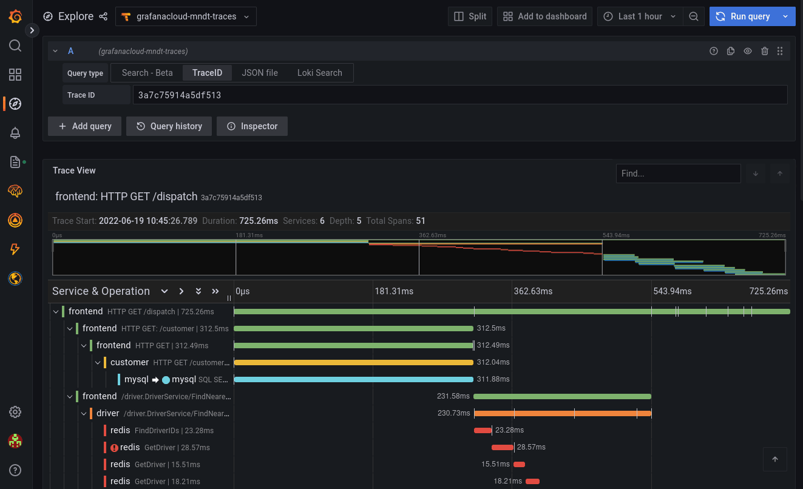

# opentelemetry-tempo-demo

A demo of sending _traces_ to Tempo, from a demo app.

My implementation of the great blog post at: <https://grafana.com/blog/2021/04/13/how-to-send-traces-to-grafana-clouds-tempo-service-with-opentelemetry-collector/>

This demo uses:

- Grafana dashboard

- Tempo distributed tracing backend

- [HotROD][hotrod], a very cool sample ride-hailing app, which is instrumented to send distributed traces

- [OpenTelemetry Collector][otelcollect] for sending traces and logs

- Podman, for running everything

## To run

You need instances of Grafana and Tempo first. Easiest way to get this is with the [free tier on Grafana Cloud][cloud].

Create a file `.env` to set your Tempo endpoint, and auth details. For `TEMPO_AUTH_STRING`, you should base64-encode: your Grafana Cloud Tempo username + `:` + API key

```
TEMPO_ENDPOINT=tempo.example.com:443
TEMPO_AUTH_STRING=xxxxxxxxxyYYYYYYYYYYYYYY
```

Then I used Podman to get this up and running:

```
podman-compose -f docker-compose.yaml up
```

Look in the logs to find a **trace ID**:

```
podman logs opentelemetrytempodemo_hotrod_1
```

Then plug that _trace ID_ into Grafana &rarr; Explore &rarr; Tempo &rarr; query by Trace ID (assuming that you've already configured Tempo as a datasource):



## FIN

[cloud]: https://grafana.com/products/cloud/
[otelcollect]: https://opentelemetry.io/docs/collector/
[hotrod]: https://medium.com/opentracing/take-opentracing-for-a-hotrod-ride-f6e3141f7941
[opentracing-go]: https://github.com/opentracing/opentracing-go

